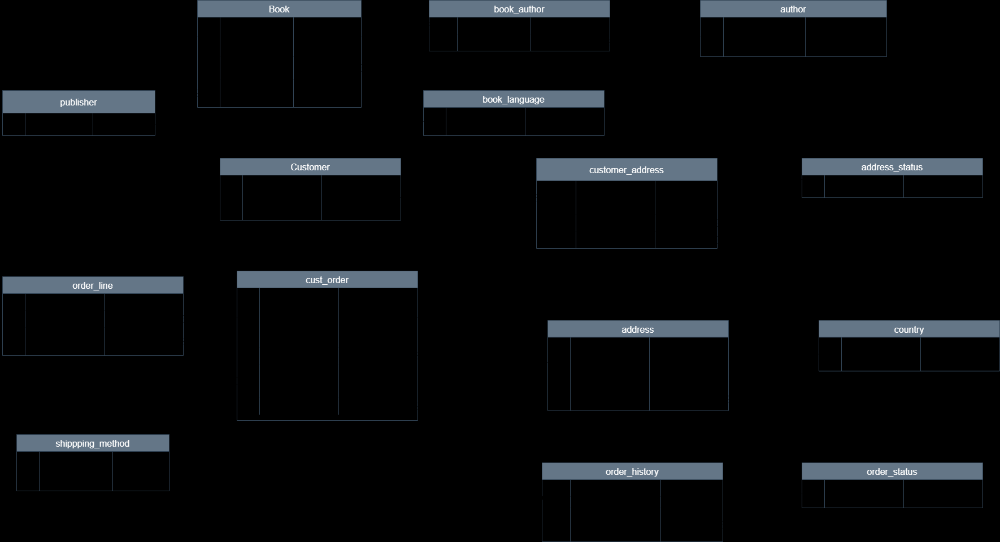

# 📚 Bookstore Management System 

The Bookstore Management System is an open-source project designed to help learners develop practical skills in managing databases for real-world applications. This system simulates key bookstore operations, such as managing books, tracking customer orders, handling payments, and maintaining inventory. Through this project, learners will gain experience in designing a relational database, creating structured tables, defining relationships, and applying best practices in database normalization. The system offers a great opportunity to enhance database management skills while simulating a dynamic business environment like a bookstore.

# ✅ Project Objectives
This project aims at helping learners grasp and apply essential database design concepts including:

    1. Designing a real-world relational database in MySQL.
    2. Creating optimized table schemas with constraints and relationships.
    3. Setting up access control with user roles and privileges
    4. Performing effective SQL queries to generate insights from data.

## 💻 Requirements

MySQL Server or compatible SQL database.
SQL editor (e.g., MySQL Workbench, DBeaver, VS Code with SQL extensions).
Intermediate knowledge of SQL (DDL, DML, and basic querying).

### 📂 Project Structure
The project directory is organized as follows:
```
bookstore-db/
├── schema.sql           -- Contains all CREATE TABLE statements
├── insert_data.sql      -- Contains INSERT INTO statements for sample data
├── queries.sql          -- Sample queries to test database functionality
├── users_roles.sql      -- Script to manage users and roles
└── README.md            -- Documentation for the project

## 🗺️ Bookstore ERD

Below is the ERD representing the structure of the Bookstore Management System database:


```

## 👥 Contributors

The following individuals have contributed to this project:

<div>
<a href="https://github.com/nakhanu" target="_blank">
  
  <br />
  <b>Sophia Nakhanu</b>
</a>

<br /><br />

<a href="https://github.com/IrvineArita" target="_blank">
  
  <br />
  <b>Irvine Arita</b>
</a>

<br /><br />

<a href="https://github.com/Janeanny1" target="_blank">
  
  <br />
  <b>Janet Anne</b>
</a>

</div>

---

✨ **Good Luck!**  
Happy querying! 🚀


